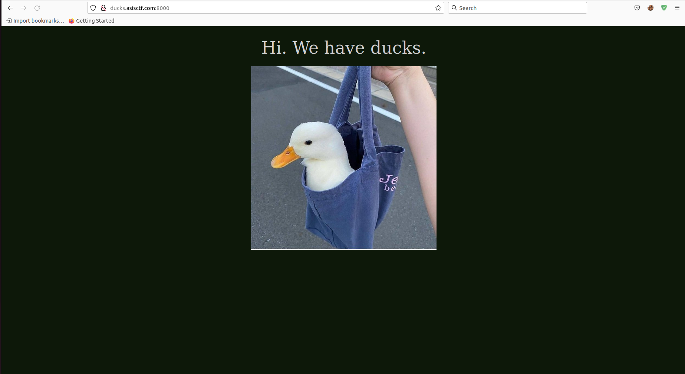
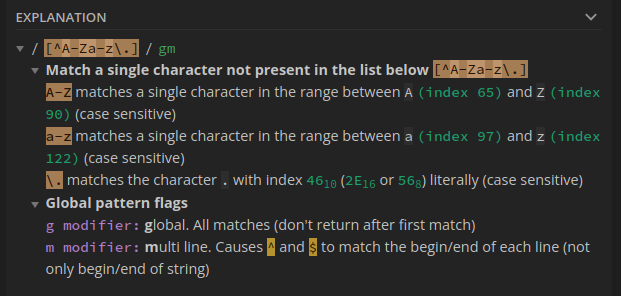
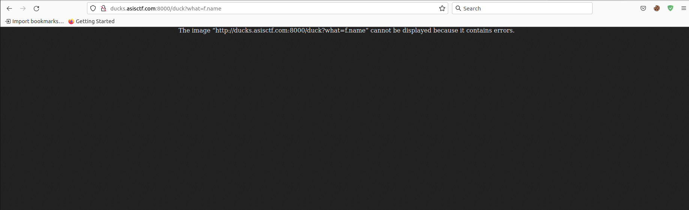
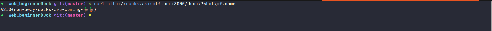

## Beginner ducks

Category: Web Exploitation <br>
Points: 500 <br>
Solves: 176 <br>

> Hiiiii, welcome to ASIS CTF. We have ducks. Check them out here Note for beginners: If you haven't played CTF before, this video might help you to understand what you have to do.

### Solution
Accessing the website, we were introduced with a website showing pictures of ducks. <br>


The given source code is:
```python
#!/usr/bin/env python3
from flask import Flask,request,Response
import random
import re

app = Flask(__name__)
availableDucks = ['duckInABag','duckLookingAtAHacker','duckWithAFreeHugsSign']
indexTemplate = None
flag = None

@app.route('/duck')
def retDuck():
	what = request.args.get('what')
	duckInABag = './images/e146727ce27b9ed172e70d85b2da4736.jpeg'
	duckLookingAtAHacker = './images/591233537c16718427dc3c23429de172.jpeg'
	duckWithAFreeHugsSign = './images/25058ec9ffd96a8bcd4fcb28ef4ca72b.jpeg'

	if(not what or re.search(r'[^A-Za-z\.]',what)):
		return 'what?'

	with open(eval(what),'rb') as f:
		return Response(f.read(), mimetype='image/jpeg')

@app.route("/")
def index():
	return indexTemplate.replace('WHAT',random.choice(availableDucks))

with open('./index.html') as f:
	indexTemplate = f.read() 
with open('/flag.txt') as f:
	flag = f.read()

if(__name__ == '__main__'):
	app.run(port=8000)
```

This is a Flask website with quite simple source code, so let's analyze it!
- Line 11 -> 22: This show the `/duck` site. First, it gets the argument passed to `what` to a variable called `what`. Then, in line 18, if `what` is empty or contains invalid character (which is checked by the regular expression `[^A-Za-z\.]`, the site will return `what?`. Otherwise, the `what` argument is passed into the `eval()` function, then will be opened, and will response to the user in the image form (check `mimetype`). <br>

- Line 24 -> 26: By default, when user visits the site, a random duck picture will be chosen, then responses to the user.
- Line 30 -> 31: The flag file is opened and passed to the variable `f`. But it doesn't close the file?

So the problem in this website is the `what` argument. User can pass anything which doesn't violate the regular expression to it, so how about passing a function to read the flag?

But the regular expression only allows letter from `a-z`, `A-Z` and the dot sign `.`. So we can only pass attribute of an object to `what`. The question now should be: *Which attribute of which object should I pass in?*

At runtime, we have 2 potential objects to play with:
1. Flask (response, request object)
2. The `f` variable in which the `flag.txt` file was passed

I tried all attribute of `response` and `request`, but all fails since I only get a 500 status code.
Moving on to the file object, there is a `name` attribute which seems to be interesting.
> Return the name of the file. It is a read-only attribute and may not be present on all file-like objects. If the file object was created using the open() function, the file’s name is returned. Otherwise, some string indicates the source of the file object is returned.

Since the content of the flag was assigned to the variable `f`, we can use this to exploit the website. 

The website now should be:
```
http://ducks.asisctf.com:8000/duck?what=f.name
```


Hmm, we got an error. As we have seen in the line 22, all files passed in the `open()` function is displayed with the mimetype `image/jpeg`. Therefore, let's try `curl`:

```bash
curl http://ducks.asisctf.com:8000/duck?what=f.name
```

We get the flag:

