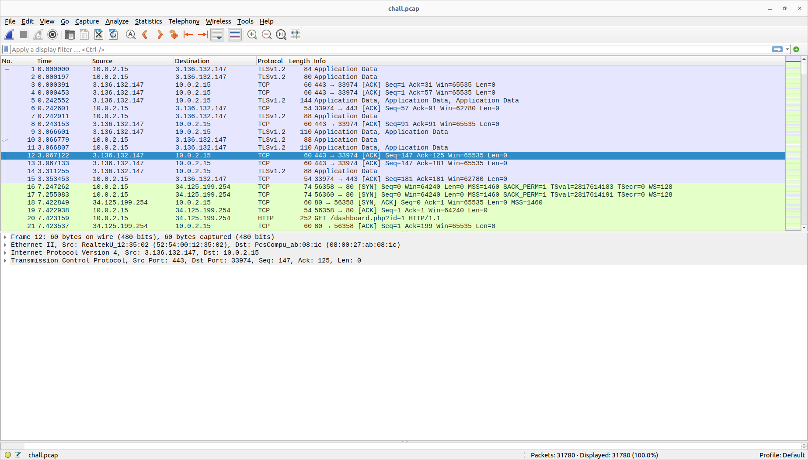
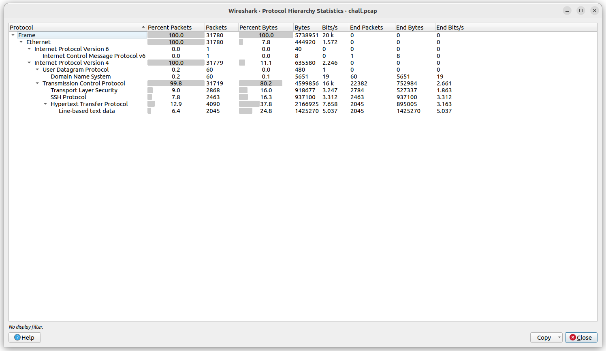
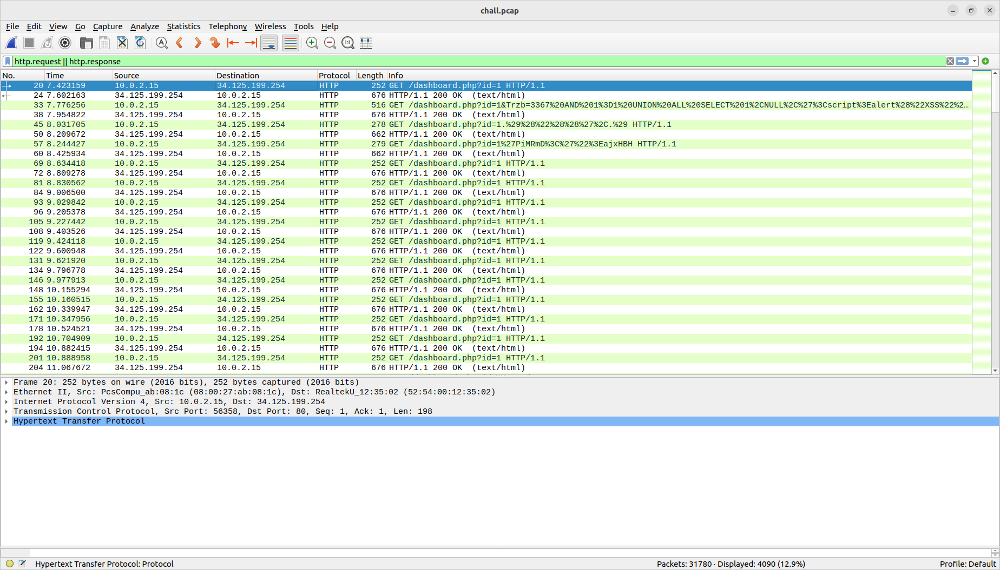

## T1M3

Category: Misc <br>
Point: 500 <br>

> Analyze the pcap

### Solution

_This write-up will go through my thinking process and explain the knowledge I learn during this. So this may be longer than normal write-up._

Opening the file in `Wireshark`, I can say that this is a large file with >31k packets sent and received. Therefore, filter is needed. <br>


Opening the Protocal Hierachy Statistics in the `Statistics` tab, we can see the type of requests being sent.


Since ICMP, DNS and TLS account for a really tiny part of the packets; the SSH packets are encrypted; our main target to analyze should be HTTP requests and responses. Let's apply this as filter. <br>
<br>
_You can also apply filter for HTTP by putting `http.request || http.response` in the search bar._


My first thought was to look at the response, guessing there might be a flag being output. However, the lengths of responses was only `662` and `676`, and the content is also similar. As a result, I need to find another way.
<br>
<br>
Moving on to the HTTP request, I can quickly that this website is being attacked with `sqlmap` (SQLi). I was suggested to dump the requests using a Python script (big thanks to my bro Spid3r).

```python
from scapy.all import *

req = {}
def my_method(packet):
    global req
    if packet[0].haslayer(TCP):
        if packet[0].dport == 80:
            if packet[0].haslayer(Raw):
                r=packet[0][0][Raw].load
                if not packet[0].sport in req:
                    req[packet[0].sport] = {}
                req[packet[0].sport]["raw"] = r.splitlines()[0]
                req[packet[0].sport]["stime"] = float(packet.time)
        elif packet[0].sport == 80:
                if packet[0].haslayer(Raw):
                    if not packet[0].dport in req:
                        req[packet[0].dport] = {}
                    req[packet[0].dport]["dtime"] = float(packet.time)
                    req[packet[0].dport]["diff"] = req[packet[0].dport]["dtime"] - req[packet[0].dport]["stime"]


def main():
    res = ""
    global req
    sniff(offline='chall.pcap', prn=my_method,store=1)
    for r in req:
        res += str(r)+"\t"+str(req[r]["diff"])+"\t"+req[r]["raw"]+"\n"
    open("payload.txt","wb").write(res)

main()
```
<br>
After running the script, we got [results](payload.txt), but it's URL-encoded, so I use this script to decode that:

```python
from urllib.parse import unquote
with open('payload.txt') as f:
    payloads = f.readlines()

for payload in payloads:
    print(unquote(payload))
```
And finally, we got our key to the flag. [requests.txt](requests.txt)
<br>
<br>
### A look inside the `requests.txt`
As I have mentioned before, this server is vulnerable to SQL Injections, and we also see the keyword `SLEEP` in the SQL query, we can identify that the attacker use SQLi Time-based technique to brute-force the data.

> SQLi Time-based technique requires attacker to check how many seconds does a request take. If the time is longer than the value in `SLEEP` function, we can determine that statement is `TRUE`, and the opposite is also right.

If you look at each request, there are something worth mentioning:
- You don't have to understand the whole SQL query.
- Each query will perform a mathematics comparision, the number is the `NCHAR` value, so find all the correct number and convert it into normal characters, we will get everything in the database.
- Every query containing `!=` is always false (the request time is always < 0), therefore, these numbers are present in the database as `NCHAR`.

### Results
Now we just need to dump data in the `myDB` tables to get the flag. Remember to use a `Decimal to ASCII` tool to convert `NCHAR` to normal character.

*The final flag is:*
```
ISITDTU{W3llC0M3_T0_ISITDTU_2@22}
```
